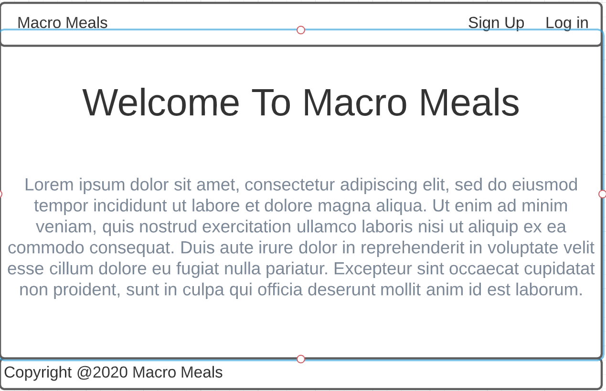
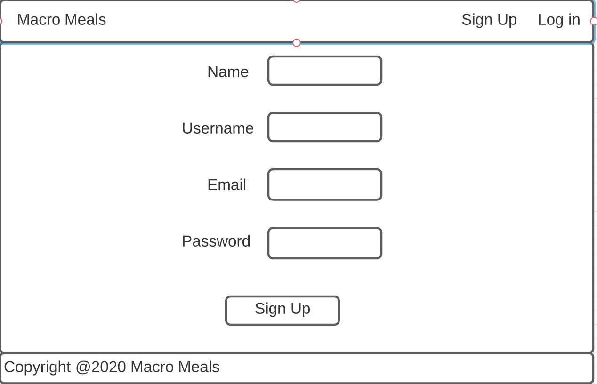
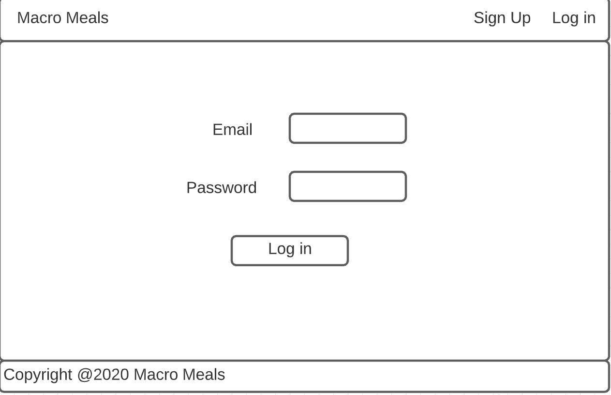
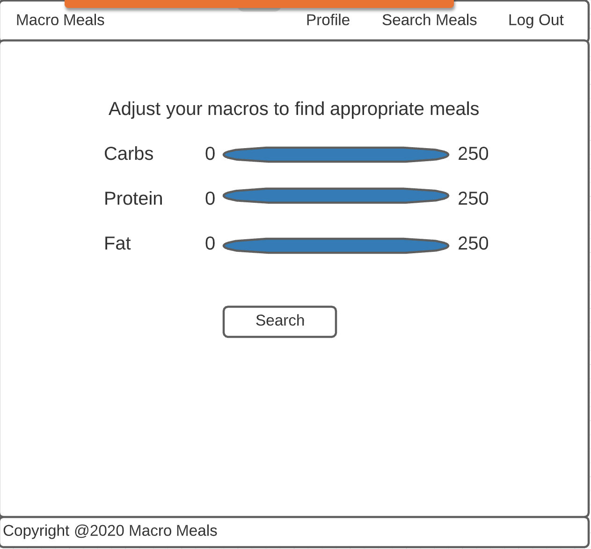
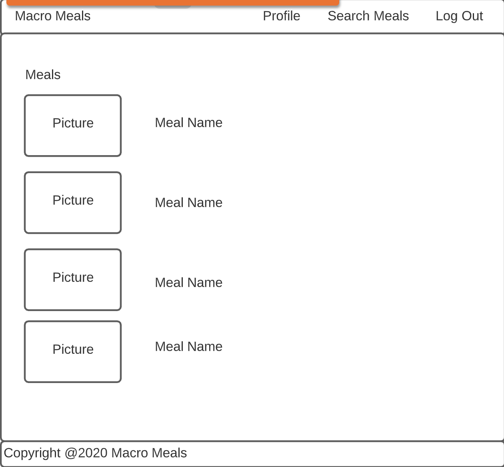
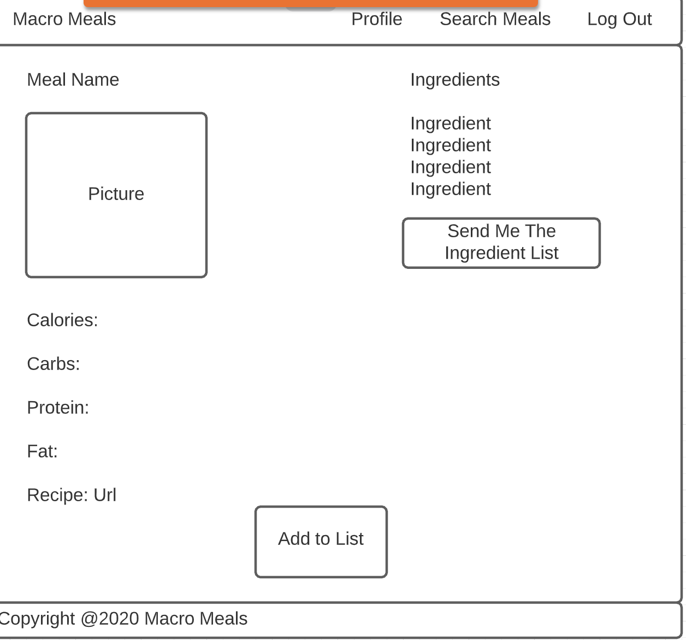
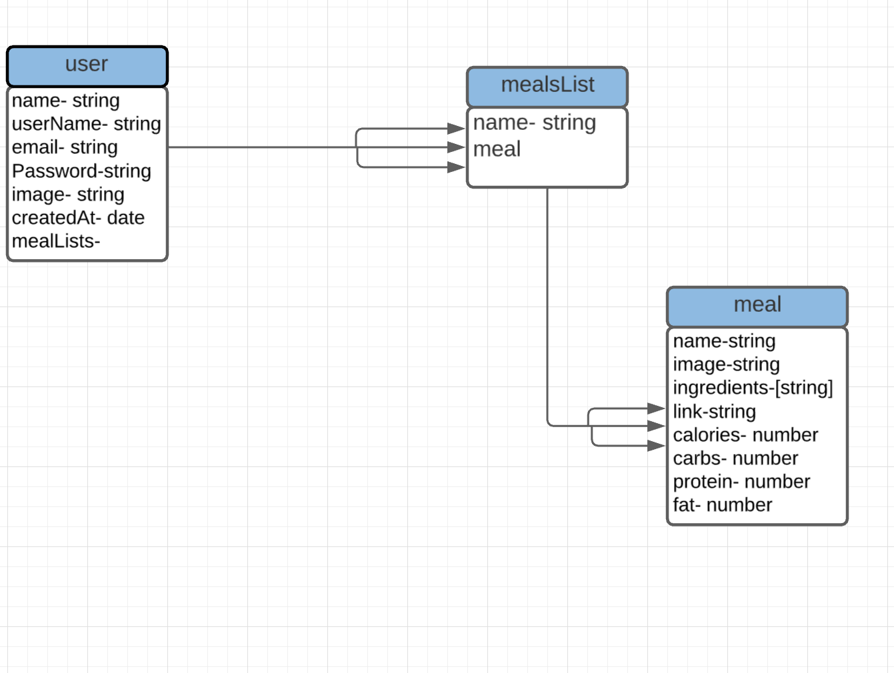

# Macro Meals

## About

This project was an inspiration of my wife.  When asking her for ideas of what I could build she wanted to see an app that let you search for meals based on specific macronutrient content.  Beyond that she had many other ideas for extra features which will be implemented at a later date.

## User Stories

This app is called Macro Meals.  The purpose of the app is to allow users to set up a profile and then search for recipe ideas based on their specific macronutrient (protein, carbohydrates, fat) requirements.Then the user can pick a recipe they like and save it to their profile.

When a user first goes to the app they will see the home page which will consist of a nav bar, a welcome message, and information about the site. The nav bar, which will appear on all pages, will consist of different links depending on if the user is logged in or not.  If they are not logged in the links will be home, sign up, and log in.  If they are signed in the nav bar will have home, profile, search meals, and log out.  

When they click on sign up they will be taken to a page where they will enter their name, username, email and password. Once they have signed up, they will receive a welcome email and they will be taken to their profile page.  They will also be taken to the profile page on log in.

The profile page will consist of the user’s username, email, a picture which will initially be a default image, an option to edit their information, a list of meals, a button to go to the search recipes page, and a button to create a new meal list.  If the user clicks on the edit profile button they will be taken to a form like the sign up except now they will also be able to upload an image.  Initially the meals list will just say “no meals yet”. The user will be able to add meals by going to the search recipes page.  

The search recipes page will have 3 range inputs representing protein, carbs, and fats.  The recipes will be filtered by if they are within 10 grams of the chosen number. Once those 3 fields are chosen, the user will click a find meals button.  This will take them to an index of all the meals that fit the criteria.  For each meal you will see the name of the meal and an image.  When you click on the meal card it will take you to a show page which has the name and image but also includes the calories, carbs, fat, protein, a basic ingredient list and a link to the actual recipe’s website page. Below the image will be a button to add the meal to the user’s meals list. Above the ingredient list will be a button that will email the ingredient list and then send you to a confirmation page that says the email has been sent. Below the image will be a button to add the meal to the user’s meals list. You will then be redirected to the profile page.

Once there are meals listed you will see the same meal card from the meals index page and there will be a button to delete the item from the list and a button to edit the recipe if you decide you want to make adjustments to the ingredients.   

## Wireframes
### Home page

### Signup

### Login

### Search

### Meals index

### Meals show

## ERDs

## Technologies Used

### Javascript
### Node Express JS
### MongoDB
### ReactJs

## Front-End Dependencies

### axios
### react
### react-dom
### react-router-dom
### react-scripts
### REACT_APP_API=http://localhost:4000/api/v1

## Future Features

There are many features that I would like to add to this as I continue to work on it.  I would like the user to be able to search not only by the specific amount of grams of the individual macronutrients but also as percentage breakdown of each component.

Another idea that was requested was the ability to filter results by specific food items (for example: chicken, fish, etc.) by dragging a picture of the item to a plate. 

I want to give the user the option to click a button on the meal show page and receive an email of the ingredient list for that meal.

I would also like to incorporate an external API to allow for many more meal options.

## More coming soon

